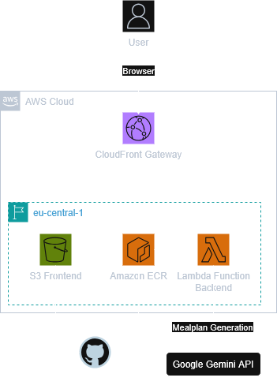

# :avocado: Keto Calculator

A full-stack keto nutrition calculator that estimates calories, macros, and a weekly weight projection from user inputs - with optional AI-generated keto meal plans.

> Educational / academic project focused on clean architecture, testability, and scientifically grounded formulas.

## :sparkles: Features

### :abacus: Core calculations

- Metric and imperial inputs (normalized internally)
- BMI (Body Mass Index)
- BMR (Basal Metabolic Rate - Mifflin-St Jeor)
- TDEE (Total Daily Energy Expenditure)
- Approximate body fat %
- FFMI (Fat-Free Mass Index)
- Goal-based calorie adjustment
  - Lose: ~20% deficit
  - Maintain
  - Gain: ~20% surplus
- Keto macros (protein / fat / net carbs)
- Weekly weight forecast chart (frontend)

### :robot: LLM meal plan generation (optional)

- AI-generated keto meal plans based on your calculated macros
- Structured JSON output (`days` -> `meals` -> `items` with grams, plus totals)
- Shopping list + assumptions included
- Uses Google Gemini API (free tier)

**Notes**
- LLM output is non-deterministic and may be rate-limited (free tier).
- Intended as a planning aid, not strict guidance.

## :toolbox: Tech stack

**Backend**
- Python 3.12, FastAPI
- `uv` dependency management
- Pytest + Ruff
- Docker

**Frontend**
- React + Vite

**Infrastructure**
- Docker Compose
- Environment-based secrets
- AWS (deployed)

## :open_file_folder: Project structure

```text
KetoCalculator/
  backend/
    app/
      formulas/          # Calculation logic
      units.py           # Metric / imperial normalization
      calc.py            # Calculation orchestration
      services/          # LLM integration
      main.py            # FastAPI entry point
    tests/               # Pytest test suite
    Dockerfile
    pyproject.toml
  frontend/
    src/                 # React UI
    vite.config.js       # Dev proxy to backend
    package.json
  docker-compose.yml
  README.md
  docs/
    _AWS-diagram.png     # Deployment diagram (AWS)
```
## :cloud: AWS deployment (live)

- Live URL: **https://d2xlvapgg8htpu.cloudfront.net/**
- Architecture:  
  - Users hit CloudFront.  
  - CloudFront serves the frontend from S3 and routes API requests to the backend on an EC2 instance (Dockerized FastAPI).  
  - Backend makes outbound calls to Gemini for meal plan generation.  
- Diagram (GitHub-visible):  
  
- Secrets: set `GEMINI_API_KEY` in your AWS environment (e.g., SSM Parameter Store/Secrets Manager or task/env vars) before starting the backend service.


## :rocket: Running the app

### Full stack with Docker Compose (backend + frontend)

```bash
# from repo root
cp .env.example .env   # if you have one; otherwise create .env (see env section)
docker compose -f docker-compose-dev.yml up --build
```

- Backend: `http://localhost:8000`
- Frontend: `http://localhost:5173`
- Compose reads the root `.env` and passes `GEMINI_API_KEY` to the backend container.

## :lock: Environment variables

Create a `.env` in the repo root (used by Docker Compose):

```bash
GEMINI_API_KEY=your_google_api_key_here
```

## :white_check_mark: Tests & code quality

From `backend/`:

```bash
uv run pytest
uv run ruff format .
uv run ruff check .
```

- Core formulas are unit-tested
- LLM prompt logic is tested without calling the API

## :test_tube: Meal plan JSON shape (example)

```json
{
  "days": [
    {
      "day": 1,
      "meals": [
        {
          "meal_name": "lunch",
          "items": [{ "name": "chicken breast", "grams": 200, "notes": "grilled" }],
          "protein_g": 60,
          "fat_g": 8,
          "net_carbs_g": 0,
          "calories": 320
        }
      ],
      "totals": {
        "meal_name": "totals",
        "items": [],
        "protein_g": 120,
        "fat_g": 120,
        "net_carbs_g": 20,
        "calories": 2000
      }
    }
  ],
  "shopping_list": ["..."],
  "assumptions": ["..."]
}
```

## :joystick: Using the app

1) Enter inputs (unit system, goal, sex, age, height, weight, activity) and click **Calculate**.  
2) Review the **Results** panel (BMI, BMR, TDEE, macros) and the **Weight forecast** chart.  
3) A **Meal Plan** panel appears after calculating. Toggle dietary restrictions (kosher, halal, vegan, vegetarian) and click **Generate meal plan (LLM)**. The selected flags are sent to the backend and incorporated into the LLM prompt.  
4) View the generated plan (days, meals, items, totals), shopping list, and assumptions.  

Notes:
- Gemini responses can be slow or rate-limited; retry if you see an overload message.
- Always sanity-check totals and suitability for your needs.


## :brain: Scientific basis (high level)

All core calculations are based on commonly accepted scientific models:

- BMI - World Health Organization definition
- BMR - Mifflin-St Jeor equation (1990)
- TDEE - activity multiplier method
- Weight change - ~7,700 kcal per 1 kg fat mass (simplified heuristic)
- Body fat % (estimate) - BMI-based approximation
- FFMI - fat-free mass normalized by height

## :books: References

- WHO - Body Mass Index: https://www.who.int/data/gho/data/themes/theme-details/GHO/body-mass-index
- Mifflin MD, St Jeor ST (1990): https://doi.org/10.1093/ajcn/51.2.241
- Hall et al., 2011 - energy balance & weight change: https://doi.org/10.1016/j.metabol.2010.11.012

## :warning: Disclaimer

This application provides estimates only for educational and demonstration purposes.
It is not medical advice. Consult qualified professionals for personalized nutrition or health decisions.
